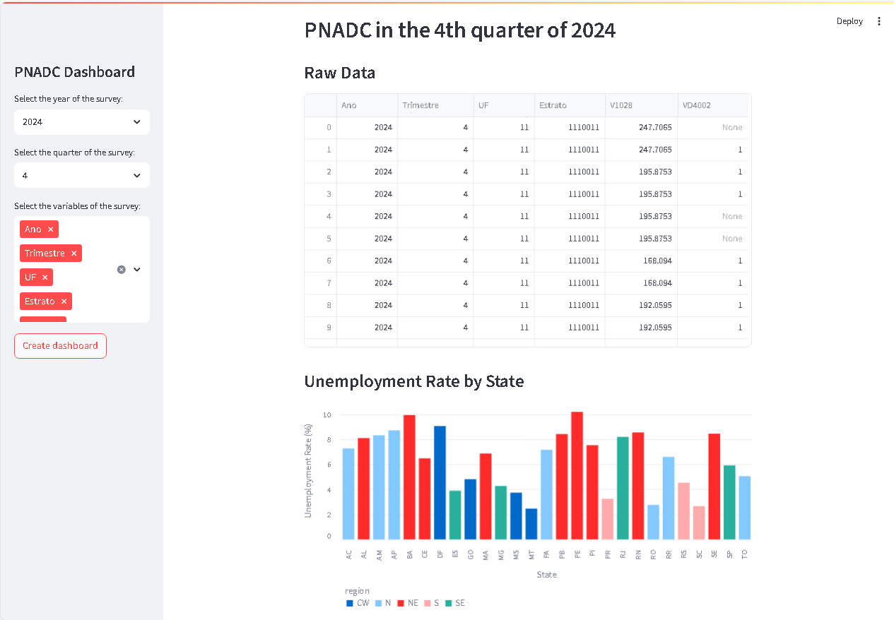
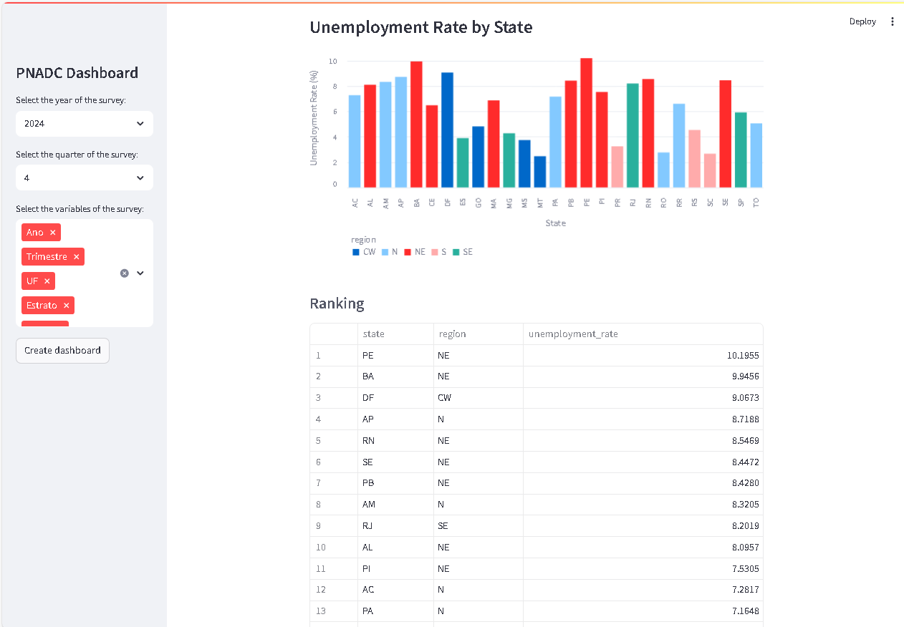

# Brazilian Population Indicators Dashboard in Python
### Introduction: A little bit of context
As part of a data science and statistics consulting firm, I collaborated on a project for a new client based in the United States who sought to gain insights into the Brazilian population. The goal was to design and develop an interactive dashboard to visualize key demographic, social, and economic indicators across Brazil.

To build this dashboard, we chose to work with the PNAD Contínua Trimestral (Continuous National Household Sample Survey – Quarterly), one of the most comprehensive microdata sources available from the Brazilian Institute of Geography and Statistics (IBGE). This dataset offers detailed, high-frequency information about employment, income, education, housing, and other critical aspects of the Brazilian population.

### Some images from the dashboard

